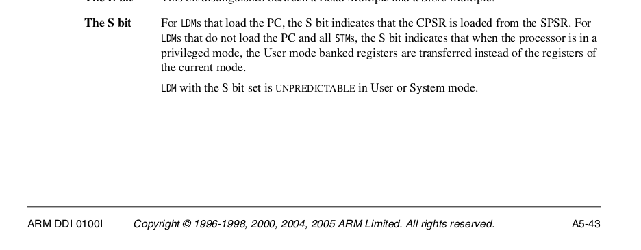

## simple user processes and equivalance checking.

Today you're going to do a wildly useful trick for ruthlessly detecting
subtle operating system mistakes.  It will prove invaluable next week
when we do virtual memory --- a topic that has extremely hard-to-track-down
bugs if you just use "normal" testing of running programs and checking 
print statements and exit codes.

In order to do so we give you:
  1. A trivial operating system (`trivial-os`) that has a single process,
     switches to it, and when it is finished, reboots.

  2. A trivial user-level mode implementation has has three system calls:
     `sys_putc`, `sys_put_hex` and `sys_exit`.

  3. The user level code only communicates with the system level using 
     system calls.

This will start getting you used to user-level vs kernel stuff.  Also,
we need code at user level so (1) single-stepping works and (2) the
addresses are the same for everyone.

--------------------------------------------------------------------
### What to do

I will fill in a bunch of background.  But to kickstart things, we'll
describe what to do.

The lab has five parts; 
  1. You control which of the five parts is being run by modifying
     the `part` variable in `trivial-kernel/trivial-os.c` and set it to `0`,
     `1`, etc.  You can also use the given enumeration type.

  2. You should do all `make` invocations in `trivial-user-level` since
     that is what actually runs things.

  3. All your real modifications will be done in `trivial-os/equiv.c` or
     in `trivial-os/trivial-os-asm.S`.  You should not have to touch
     `trivial-user-level`.

What to do for each part:

  0. We give you the code for part 0.  This part just "loads" the
     user program (using `program_get`) and jumps to it directly, running
     it in kernel mode.  The user program does system calls to call back
     into the `trivial-os`.  This gives you a simple starting point.

     *What to do*: follow the flow of control and make sure understand what
     is going on.  This is useful to help you get orientated with what
     the code is doing, since its a bit weird compared to the past labs.

     In the previous labs we just linked all the code together.  However,
     that doesn't make sense with user code.  ("Why?") Normally we would
     load a user program from a file system.  ("Why?")  However, we do
     not have a file system  (yet) and so do the following hack (which
     is useful elsewhere, so no worries).

     We use the program `trivial-user-level/pitag-linker` to concatenate
     the user program to the `trivial-os.bin`  and produce a new binary we
     can bootload over and jump to.  Mechanically this lets us combine
     two distinct programs.

     However, just as with linux and macos, the user cannot call the OS
     routines directly since it was not linked with them.  (Also, in the
     future: it does not have the right permissions).  So instead all
     "function calls" from user to the trivial-os are system calls.  Because
     system call numbers do not change (ours are in `trivial-os/syscalls.h`)
     the user code can call the `trivial-os` no matter
     how its code has dilated or shrunk.

  1. You will write `user_mode_run_fn` (in `trivial-os/trivial-os-asm.S`).
     This will change to user mode (using the `cps` instruction),
     set the stack pointer to the value given, and jump to the code.
     This should be a short routine.

     Importantly: the code should run identically to part 0, other than
     perhaps printing out that it is at user-level.  You should rerun
     the programs using `part=0` and `part=1` and verify they both do
     the same thing.

  2. This part demonstrates how to use the single-stepping routines that
     we give you.  The exception handler used is in
     `trivial-os/single-step.c`.  When you run with it enabled, it will
     print out all the `pc` addresses in order that execute at user level
     (you cannot single-step when not in user mode).

     *What do to*: you should verify that the addresses being printed
     make sense.  They should first be after the `cps` instruction in
     part 1.  Then they will be in the `start` routine and `notmain` and
     then in the user-level code needed to call `sys_exit`.  Make sure you
     understand what is going on or the next parts will be hard to debug.

   3. You will trace all the program counter values and hash them.
      This code looks very similar to Part 2, except you need to figure
      out when the code has finished executing `user_mode_run_fn` (since
      its addresses will change).  The way you can do this is to look at
      the `pc` --- if this is above our kernel heap, it's in user mode.
      If not, its still in the kernel.

      *What to do*: Implement both the exception handler in
       `equiv.c:prefetch_abort_equiv_pc` and  the trampoline that sets
       up its state in `trivial-os-asm.S:prefetch_handler_equiv_pc` You
       should look at how single-stepping does both of these.  If you
       are not getting exceptions, you didn't reset the mismatching in
       the handler.

       You should check that your hashes match everyone else's.  I'll add
       more tests.  I would start with `0-test-nop.c` since that is a
       trivial program.  I also checked in some pre-built binaries in
       `trivial-user-level-prebuilt` since it appears people's compilers
       can give slightly different output.
     
       You should only count instructions you hash.

   4. Finally you will hash all the register values and the `spsr`.
      This is a very harsh test.

      *What to do* you'll build the trampoline for this part in
      `trivial-os-asm.S`.  You should push all sixteen *user-level*
      registers onto the stack and the `spsr` and pass the base of
      this 17 entry array to the handler so you can hash it the same
      as everyone else.  (Easiest way: subtract the amount you want,
      then do an `stm`.)  The way you do this should allow a single
      special load at the end of the handler so you can resume 
      execution.

      You should push the registers from highest to lowest offset.  So,
      `r0` at offset 0, `r1` at offset 4, r15 (the pc) at offset 60,
      and the `spsr` at offset 64.  The base of this array should be
      passed to the handler.  Note: stack goes down and arrays go up so
      you'll likely have to subtract before storing on the stack.

      Your hashes should match everyone else.  I'll add more tests.

      NOTE: we do not want the value of any exception shadow register,
      we want the actual user value, so you'll have to figure out how
      to get that with a store.  Some hints are given below.

      If you are getting differences: make sure you clear *all* registers
      besides `r0` and `r1` and the `pc` --- you should clear the `cpsr`
      by writing a zeroed register into it once you make the user mode
      switch.  You also clear `lr` since we are never returning and it
      will almost certainly be different for everyone.

Hints for part 4:

  - I used `stm` and `ldm`.  It's trickier to use
    `push` and `pop` since they modify the `sp` and its illegal to do
    so when `sp` is not the highest register pushed.

  - As we covered in the interrupt handling lab: the exception
    context has its own shadow copies of `sp` and `lr` --- so you cannot
    simply push these "raw" --- you have to push the user level copies.
    Further, `pc` is *not* shadowed --- so you'll have to use the computed
    value in `lr`.

  - You cannot store `spsr` directly .  You'll have to put it in a 
    general purpose register (this is ok: we just saved a bunch so
    can use them).

  - When you are in the handler, you should check that the register
    at the `r15` (pc) offset actually matches the `pc` value you have.
    Also, you should check that the value at the `spsr` offset matches
    your `spsr`.

we are modify the `sp`,
 --- since we are pushing the `sp` 

-------------------------------------------------------------------
#### Part 3: PC Hashes

Below are some of the hashes I got for the test programs.  The main thing
to pay attention to is the final two `TRACE:EQUIV` print statements
that give the final number of instructions and the final pc hash.
The instruction count is just those instructions that got hashed.

I would start with `0-test-nop.c` since it is the simplest:

    TRACE:simple_boot: sending 11414 bytes, crc32=2f9501d7
    waiting for a start
    pi: <addr=0x8000, n=11414, cksum=0x2f9501d7>
    putting code
    bootloader: Done.
    listening on ttyusb=</dev/ttyUSB0>
    kernel: stack is roughly at: 0x7ffffe8
    user_code=0x400004, prog name=<0-test-nop.bin>
    TRACE:inst 0 = pc=0x400004, pc_hash=0xa3d1fb72
    TRACE:inst 1 = pc=0x400010, pc_hash=0xb5f459d5
    TRACE:inst 2 = pc=0x400008, pc_hash=0x44a6b13a
    TRACE:inst 3 = pc=0x40000c, pc_hash=0x48be2e85
    TRACE:inst 4 = pc=0x400014, pc_hash=0x7fb1242d
    TRACE:inst 5 = pc=0x400018, pc_hash=0x4c6c9ecb
    TRACE:inst 6 = pc=0x40001c, pc_hash=0x2900fa70
    TRACE:inst 7 = pc=0x400020, pc_hash=0xca1ba4db
    TRACE:inst 8 = pc=0x4000e4, pc_hash=0x7c98abf1
    TRACE:inst 9 = pc=0x4000e8, pc_hash=0xafd42265
    0-test-nop.bin: sys_exit(-1): going to reboot
    part=3
    equiv values
    TRACE:EQUIV:	number instructions = 10
    TRACE:EQUIV:	pc hash = 0xafd42265
    DONE!!!

Then `0-test-exit.c` since it is the simplest:

    TRACE:simple_boot: sending 11423 bytes, crc32=cc87ea74
    user_code=0x400004, prog name=<0-test-exit.bin>
    TRACE:inst 0 = pc=0x400004, pc_hash=0xa3d1fb72
    TRACE:inst 1 = pc=0x400010, pc_hash=0xb5f459d5
    TRACE:inst 2 = pc=0x400014, pc_hash=0x625d1830
    TRACE:inst 3 = pc=0x400018, pc_hash=0x3db2a8ee
    TRACE:inst 4 = pc=0x400020, pc_hash=0x4e403840
    TRACE:inst 5 = pc=0x400024, pc_hash=0x31fa5b24
    TRACE:inst 6 = pc=0x400028, pc_hash=0xfd7f8720
    TRACE:inst 7 = pc=0x40002c, pc_hash=0xd449b7d7
    TRACE:inst 8 = pc=0x4000f0, pc_hash=0x3500ce93
    TRACE:inst 9 = pc=0x4000f4, pc_hash=0x4696ca4e
    0-test-exit.bin: sys_exit(0): going to reboot
    part=3
    equiv values
    TRACE:EQUIV:	number instructions = 10
    TRACE:EQUIV:	pc hash = 0x4696ca4e
    
For `1-test-hello.c`:

    TRACE:simple_boot: sending 11652 bytes, crc32=e3df0073
    TRACE:inst 0 = pc=0x400004, pc_hash=0xa3d1fb72
     TRACE:inst 1 = pc=0x400010, pc_hash=0xb5f459d5
    TRACE:inst 2 = pc=0x400014, pc_hash=0x625d1830
    TRACE:inst 3 = pc=0x400018, pc_hash=0x3db2a8ee
    TRACE:inst 4 = pc=0x4000ac, pc_hash=0x1e2417b1
    TRACE:inst 5 = pc=0x4000b0, pc_hash=0x2467244e
    TRACE:inst 6 = pc=0x4000b4, pc_hash=0x77935371
    TRACE:inst 7 = pc=0x4000c4, pc_hash=0x88a05aeb
    TRACE:inst 8 = pc=0x4000c8, pc_hash=0x59cc4453
    TRACE:inst 9 = pc=0x4000cc, pc_hash=0x146f6ad5
    hello world
    user: stack is roughly at 0x6fffff8
    user: cpsr=0x60000190
    USER MODE!
    1-test-hello.bin: sys_exit(0): going to reboot
    part=3
    equiv values
    TRACE:EQUIV:	number instructions = 884
    TRACE:EQUIV:	pc hash = 0xd5bec853
    DONE!!!

For `3-test-vec.c`:

    TRACE:simple_boot: sending 11486 bytes, crc32=cb1d156d
    waiting for a start
    pi: <addr=0x8000, n=11486, cksum=0xcb1d156d>
    putting code
    bootloader: Done.
    listening on ttyusb=</dev/ttyUSB0>
    kernel: stack is roughly at: 0x7ffffe8
    user_code=0x400004, prog name=<3-test-vec.bin>
    TRACE:inst 0 = pc=0x400004, pc_hash=0xa3d1fb72
    TRACE:inst 1 = pc=0x400010, pc_hash=0xb5f459d5
    TRACE:inst 2 = pc=0x400014, pc_hash=0x625d1830
    TRACE:inst 3 = pc=0x400018, pc_hash=0x3db2a8ee
    TRACE:inst 4 = pc=0x400028, pc_hash=0xd88ec3d5
    TRACE:inst 5 = pc=0x40002c, pc_hash=0xfdf9a1ed
    TRACE:inst 6 = pc=0x40001c, pc_hash=0x7fab503d
    TRACE:inst 7 = pc=0x400020, pc_hash=0x413ff992
    TRACE:inst 8 = pc=0x400024, pc_hash=0xead93cec
    TRACE:inst 9 = pc=0x400028, pc_hash=0x4115398d
    3-test-vec.bin: sys_exit(0): going to reboot
    part=3
    equiv values
    TRACE:EQUIV:	number instructions = 194
    TRACE:EQUIV:	pc hash = 0x22ab7818
    DONE!!!

From `trivial-user-level-prebuilt` (or if your compiler matches
our output: `trivial-user-level`):
    
        TESTS := $(wildcard ./[0-3]*-test-*.c)

        # emit all the .outs
        % make emitall

        # cksum the .outs and canonicalize
        % grep EQUIV *.out | sort -n | cksum
        799754351 496

---------------------------------------------------------
### Part 4: Full reg hash

Note:
  - do not clear `r1`.
  - do clear `cpsr` once you're in user mode otherwise the carry
    flags can be different.
  - definitely don't clear `r13`!

        user_code=0x400004, prog name=<0-test-nop.bin>
        TRACE:	reg hash=0xfac07451
        TRACE:	spsr=0x190
        TRACE:	pc = 0x400004, lr = 0x400004
        TRACE:	regs[0] = 0x400004
        TRACE:	regs[1] = 0x7000000
        TRACE:	regs[2] = 0x0
        TRACE:	regs[3] = 0x0
        TRACE:	regs[4] = 0x0
        TRACE:	regs[5] = 0x0
        TRACE:	regs[6] = 0x0
        TRACE:	regs[7] = 0x0
        TRACE:	regs[8] = 0x0
        TRACE:	regs[9] = 0x0
        TRACE:	regs[10] = 0x0
        TRACE:	regs[11] = 0x0
        TRACE:	regs[12] = 0x0
        TRACE:	regs[13] = 0x7000000
        TRACE:	regs[14] = 0x0
        TRACE:	regs[15] = 0x400004
        TRACE:------------------------------------------------------
        TRACE:	reg hash=0x831b8654
        TRACE:	spsr=0x190
        TRACE:	pc = 0x400010, lr = 0x400010
        TRACE:	regs[0] = 0x400004
        TRACE:	regs[1] = 0x7000000
        TRACE:	regs[2] = 0x0
        TRACE:	regs[3] = 0x0
        TRACE:	regs[4] = 0x0
        TRACE:	regs[5] = 0x0
        TRACE:	regs[6] = 0x0
        TRACE:	regs[7] = 0x0
        TRACE:	regs[8] = 0x0
        TRACE:	regs[9] = 0x0
        TRACE:	regs[10] = 0x0
        TRACE:	regs[11] = 0x0
        TRACE:	regs[12] = 0x0
        TRACE:	regs[13] = 0x7000000
        TRACE:	regs[14] = 0x400008
        TRACE:	regs[15] = 0x400010
        TRACE:------------------------------------------------------
        TRACE:	reg hash=0xdb3c14aa
        TRACE:	spsr=0x190
        TRACE:	pc = 0x400008, lr = 0x400008
        TRACE:	regs[0] = 0x400004
        TRACE:	regs[1] = 0x7000000
        TRACE:	regs[2] = 0x0
        TRACE:	regs[3] = 0x0
        TRACE:	regs[4] = 0x0
        TRACE:	regs[5] = 0x0
        TRACE:	regs[6] = 0x0
        TRACE:	regs[7] = 0x0
        TRACE:	regs[8] = 0x0
        TRACE:	regs[9] = 0x0
        TRACE:	regs[10] = 0x0
        TRACE:	regs[11] = 0x0
        TRACE:	regs[12] = 0x0
        TRACE:	regs[13] = 0x7000000
        TRACE:	regs[14] = 0x400008
        TRACE:	regs[15] = 0x400008
        TRACE:------------------------------------------------------
        TRACE:	reg hash=0x79ec1afc
        TRACE:	spsr=0x190
        TRACE:	pc = 0x40000c, lr = 0x40000c
        TRACE:	regs[0] = 0xffffffff
        TRACE:	regs[1] = 0x7000000
        TRACE:	regs[2] = 0x0
        TRACE:	regs[3] = 0x0
        TRACE:	regs[4] = 0x0
        TRACE:	regs[5] = 0x0
        TRACE:	regs[6] = 0x0
        TRACE:	regs[7] = 0x0
        TRACE:	regs[8] = 0x0
        TRACE:	regs[9] = 0x0
        TRACE:	regs[10] = 0x0
        TRACE:	regs[11] = 0x0
        TRACE:	regs[12] = 0x0
        TRACE:	regs[13] = 0x7000000
        TRACE:	regs[14] = 0x400008
        TRACE:	regs[15] = 0x40000c
        TRACE:------------------------------------------------------
        0-test-nop.bin: sys_exit(-1): going to reboot
        part=4
        equiv values
        TRACE:EQUIV:	number instructions = 10
        TRACE:EQUIV:	reg hash = 0xc5b473a4
        DONE!!!
        

0-test-exit.bin:
        
        TRACE:EQUIV:	number instructions = 10
        TRACE:EQUIV:	reg hash = 0x1ee2a76e

1-test-hello.bin: 

        TRACE:EQUIV:	number instructions = 884
        TRACE:EQUIV:	reg hash = 0xe9817e19

3-test-vec.bin:

        TRACE:EQUIV:	number instructions = 194
        TRACE:EQUIV:	reg hash = 0x22edf8ea

From `trivial-user-level-prebuilt` (or if your compiler matches
our output: `trivial-user-level`):

        # all tests
        TESTS := $(wildcard ./[0-3]*-test-*.c)

        # generate the .out's
        % make emitall

        # cksum everything.
        % grep EQUIV *.out | sort -n | cksum
        4147204067 500

--------------------------------------------------------------------
Part 5: replace our `breakpoint.h` implementation

The code currently calls our single-step implementation (in
`single-step.o`).  For this part, you should modify your debug hardware
code to support mismatching and implement the following routines:

        // this will mismatch on the first instruction at user level.
        void brkpt_mismatch_start(void);

        // stop mismatching.
        void brkpt_mismatch_stop(void);

        // set a mismatch on <addr> --- we'll get a prefetch abort 
        // on any pc value that is not equal to <addr>
        void brkpt_mismatch_set(uint32_t addr);

In a common pattern for equivalance checking: when you drop this in,
and rerun the hashes they should be the same.    

--------------------------------------------------------------------
Part 6: setup your code to use timer interrupts

Whether we have interrupts or not, user mode behavior should not chnage.
Check this by:
  1. Add a part 5 that configures and uses timer interrupts (using code
     similar to `6-interrupts`).
  2. Rerun the hashes: none should change.  
  3. As you make the interrupts closer and closer, no hash should change.

--------------------------------------------------------------------
Context switching: user-level context saving and restoring

This lab found an interesting bug in our old context switching code.
When doing single stepping, we can't simply do:

        ldm r0, {r0-r15}^

to reload user state.  If you look at the ARMv6 document, you'll see
`ldm` behaves differently depending on if you have the `pc` (`r15`)
as one of the registers.

<table><tr><td>
  
</td></tr></table>

This bug is a bit interesting in that we missed this nuance for the past
4-5 years but had managed to avoid getting bitten by it despite doing
context switching in different ways b/c of how it was implemented.
We didn't realize the bug in lab 10 because we had no other process
running.

In any case, first step is to fix your code to use `rfe` and (if you
want) `srs` to restore and save state. If you look at the `prelab-code`
directory you'll see an example that uses them.  You'll want to look in
the ARMv6 manual to make sure you understand.

What to do:
   1. Copy your `10-process/code` into `15-integration/code` (we never
      want to mutate a working system that we've already checked).
   2. Make sure your tests run as before.
   3. Rewrite the equivalance assembly to use the `rfe` instructon
      at the end.
   4. Make sure your tests still pass!

