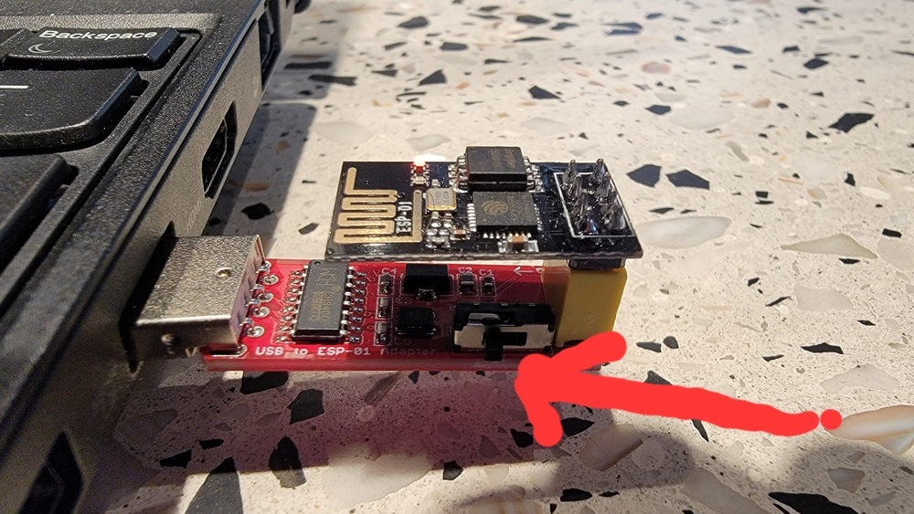

## Simple networking with the ESP8266

The most important rule for today:

   ***MAKE SURE YOU ONLY CONNECT the ESP TO 3V (NOT 5V) power***

This lab we will use the ESP8266 chip (version: esp-01) to connect your
pi to your laptop and/or to another pi.

The ESP8266 is a cheap, reasonable way to add wireless to various
projects assuming they don't need extremely low latency or high bandwidth.
It can can assign wireless IP addresses (be a dhcp server), a webserver
and communicate using TCP or UDP.

We will control the ESP8266 using `AT` commands, which means we will
send the ESP8266 human-readable character string commands (the first
token will be an `AT`, hence the name) using the same 8n1 UART protocol
we use to communicate with your pi.  You should look in the `docs`
directory and read:

Workflow:

 0. Get two esp8266's, one programmer (see below) and another tty-USB device.
 1. Make sure both esp's work.
 2. See how to communicate on Unix.
 3. Convert the code to communicte on the pi.
 4. Do something cool.

#### Checkoff

Deliverables: today is kind of a light lab:

  1. You can ping-pong a value with your patner using TCP on Unix.
  2. [Maybe: trying to fix `sw-uart-int`]You can ping-pong a value
     between your laptop and your pi.  (From this stepping stone you can
     (if so inclined) build a network version of `GET32` and `PUT32`
     and control a pi remotely.)
  3. Do something interesting with the esp (below).

------------------------------------------------------------------------------
### Part 0: Make sure your esp8266's work

Before doing anything, make sure that the `esp8266` device you have
actually works.

#### A. Quick test hardware  with the programmer

As the quickest test, plug it into the USB programmer we gave out and
see that `esp-shell` gives an `OK` when you type `AT`.

  1. The esp is the small device on top, and the programmer is the larger
     device plugged into my USB port.  Make sure that the little switch
     (red arrow) is pushed to the left:

  

     The programmer is cool since it makes it easy to update the ESP's
     firmware.  (Ours is pretty old: 2016.)

  2. Once you plug it into your laptop, run the shell:

            % cd esp-shell/
            % make
            % ./esp-shell --ack
            about to communicate with </dev/ttyUSB0>
            AT   #    <---- type this
            AT   #    <---- esp first echoes command
            OK   #    <---- esp then sends "OK"

   3. Try the other ESP with the programmer as well (since it's hard to miswire).

#### B. Test with a tty-USB device

Reconnect one of them to the tty-USB device you picked up and make sure
it also works using the same steps above.  Which pin is which is printed
on the underside of the ESP.

The most important rule:

   ***MAKE SURE YOU ONLY CONNECT TO THE 3V (NOT THE 5V)***

   ***MAKE SURE YOU ONLY CONNECT TO THE 3V (NOT THE 5V)***

   ***MAKE SURE YOU ONLY CONNECT TO THE 3V (NOT THE 5V)***

   ***MAKE SURE YOU ONLY CONNECT TO THE 3V (NOT THE 5V)***

   ***MAKE SURE YOU ONLY CONNECT TO THE 3V (NOT THE 5V)***

It will fry, and I only have so many of them.

If you don't get any communication, the tty-USB could be broken or,
much more likely, you could have miswired.

NOTE: it looks like the ESP changed and we now need a jumper connecting
the reset pin (`RST`) and the enable pin (`EN`):  if your esp works fine
with the programmer and not with the tty-usb, this is likely an issue:

  

#### C. Test that you can ping two devices at once

Before you start writing code, make sure you can run the `client` and
`server` programs in `1-ping-pong.  This will check:

 - Our code works in your environment.
 - Your laptop does indeed support two USB devices at once.

If it fails:
   - The bug likely is in your `find_ttyusb_first()` or `find_ttyusb_last()`.

What to do:

   0. Change the `NETWORK` constant in `libesp/esp-constants.h` to be some 
      kind of variation on your stanford SUID (so you don't conflict with 
      anyone else).  

   1. Compile:

            % cd 1-ping-pong
            % make

   2. Plug both devices into your laptop.

   3. In one window first start the server:

            % ./server
            esp-run.c:cmd_puts:51:14: issuing exp-cmd <AT+GMR>
            esp-parse.c:match_linev:244:matched line <AT+GMR>!
            esp-run.c:cmd_ack:232:esp ack'd cmd <AT+GMR>:15
	            skipping extra:: <AT version:1.1.0.0(May 11 2016 18:09:56)>
	            skipping extra:: <SDK version:1.5.4(baaeaebb)>
	            skipping extra:: <compile time:May 20 2016 15:08:19>
            esp-parse.c:match_linev:244:matched line <OK>!
            Going to wait for a connection
            0: waiting on input from esp
            100: waiting on input from esp
            200: waiting on input from esp
            ...

   4.  In another window after the server prints its waiting for input start
       the client:

            % ./client

       After a bit (the client is slow to connect) you should see values being sent back and
       forth:

            ...bunch of output sending a counter back and forth...

            going to wait on ch=0
            received ack from client=0: <hello 126>
            passed check!
            sending <hello 127>
            0: waiting on input from esp
            going to wait on ch=0
            received ack from client=0: <hello 127>
            passed check!
    
            SUCCESS!
    
       This should send data back and forth successfully.  

Useful:

  - You can easily see the commands run by this program by looking at the
    log files in the directory.  You can in theory type these commands
    into the shell yourself and get the same result.

------------------------------------------------------------------------------
### Background: `libesp` a library for communicate with an ESP8266 using AT commands.

Our code will (should) compile both for the pi and for Unix.

I'm not super happy with `libesp` so one extension is for you just to write your own.

The model:
  1. Issue a command and its expected output.
  2. Wait until the ESP echo's the literal command and then check that we got the
     output that we expected.
  3. When you have multiple connections, you can receive unexpected input, so step
     (2) should call out to auxilary routines to handle when this occurs.

     NOTE: these callouts create a "hold-and-wait" situation (one of the conditions
     needed for deadlock) where they cannot return to handle the current message
     until the callout completes.    Thus, if the callout also invokes the ESP
     it can deadlock if it gets a response to the first request since it can't
     return.  One solution is to just enqueue an event in the callout for later
     processing.  Or use threads. 

The two annoying parsing complications:
  1. The characters from the esp can trickle in at an arbitrary rate --- so we 
     can't assume we can get everything with a single `read` call.  
  2. We don't always know what we are matching against, so need a way to undo
     the input consumed from a failed match..

This is why we use the lexing code (`esp-lex.c`).  It stores characters
in a circular buffer as it receives them; if a match needs more iput,
it calls a client supplised routine to grab more.  Rollback is a matter
of just changing the tail pointer.

In order to allow this code to be run unaltered on both Unix and on our pi we do
the following:
   1. Our debugging and panic macros use the same names (as always).
   2. The input and output routines are supplied by the client --- these will be 
      different on Unix and pi, but have the same function signatures, so the 
      ESP code does not need to change.

Finally, the ESP code (or hardware) seems reasonably flakey and while the
`AT` commands have a document describing them, ESP behavior sometimes
isn't well specified.  As a result, you can get unexpected crashes
(fortunately the ESP output seems the same when this occurs so you can
string match it) and our examples for how to do some things are pulled
from blog posts and expriments.

### No, TCP does not solve your problem.

It's natural to use TCP to handle message loss (that is what it is for,
after all).  However, that will often not solve your problem since
whereever it mattered to your code that you could have lost messages,
you can still lose a host, so you still have to handle failure.

Further, there are some subtle issues with using a co-processor as a
way to get reliable a reliable bytestream.

  1. If it accepted bytes, you do not know if you in fact pulled them off the 
     ESP fast enough.  So it could have run out of buffering.
  2. It has connection identifiers.  Just b/c you start receiving messages for 
     a given connection it does not mean you are talking to who you think.  The
     previous connection could have closed, and then been reused, and then you 
     started to get data.   This gets much worse if you want to preserve state
     across node crashes (which you often do) -- when you come back, either you
     reset everything, or have to figure out who is what.   

In the end, typically I wind up including a unique machine identifier and making
whatever protocol I am trying to implement stateless.

------------------------------------------------------------------------------
### [mabye: we are working on this]:  run on your pi.

The `libesp` is written so it (should) work both on Unix and on the pi.
For this part you'll have to add some code to `pi-support.c` so that it
works with `libpi`.

  1. Connect the ESP to your pi using jumpers --- RX should be pin 20 and 
     TX should be pin 21.
  2. Check that the code works "as is" (there are staff object files). Running
     the client on the pi and the server on Unix should give the same
     result as running both on Unix.
  3.  Then start filling in `pi-support.c`.  Look at `unix-support.c` 
     to get an idea of what to do.

------------------------------------------------------------------------------
### Part 3: do some kind of extension.

#### if your final project needs networking, try that.

You can get a head start on your final project by seeing if the ESP will support what you need.

#### make your own `sw-uart-int.c` that works

Make sure your code works:

  1. Attach a jumper b/n two pins.
  2. For many iterations: Send a random string `s`.  Check that you received `s`.

Plug in your code (you'll need to call it from `pi-support.c`)  and use that.

I think the simplest way to make a `sw_uart_get8_int` is to:
  1. In the interrupt handler: Record the times that the input pin transitions.
  2. In `sw_uart_get8_int`: use these readings (1) to implement a fake
     time (measured in cycles) --- with this approach, you can take your
     `sw_uart_get8` and just redefine the cycle wait routines to call
     your synthetic time implementation.

#### Implement a network bootloader.

Simplest (maybe) approach:
  1. Hook up your esp to your pi's hardware UART.
  2. Hook up the extra tty-USB device to some other pins --- use this to print messages
     while you run the bootloader to you can more easily debug it.

#### build `net_GET32` and `net_PUT32` and control the GPIO on another pi.

The code you'll modify is in the `libesp/esp-commands.c`.  First make
sure the ping pong works.  Then start generalizing it.

Copy the ping pong code to a new directory:
  1. Change it so you can do a `PUT32` and a `GET32` and the values are
     correct back and forth.
  2. Write a driver on the pi that waitss for `net_PUT32` messages and 
     excecutes them locally.
  3. Modify a blink program to use `net_PUT32`.
  4. You should now be able to do remote blinking.
  5. If you use your partner's pi, you can modify the code so it can broadcast
     and run on multiple programs.

#### Make things more real

Start adding functionality to your `libesp`.   Please keep all your code in
`esp-commands.c` so that I can push any bug-fixes without conflicts.

  1. Try to handle mutiple client connections.  this will require you
     can accept `CONNECT` and `DISCONNECT` messages during normal message
     processing --- you will need to modify the out-of-order messages handler
     to do this.   Connect from multiple esps.

  2. Handle errors.  for the client, write the code to do a close and modify the 
     server to handle it.  Also, have the client reboot (versus getting stuck) if the
     server goes away.
